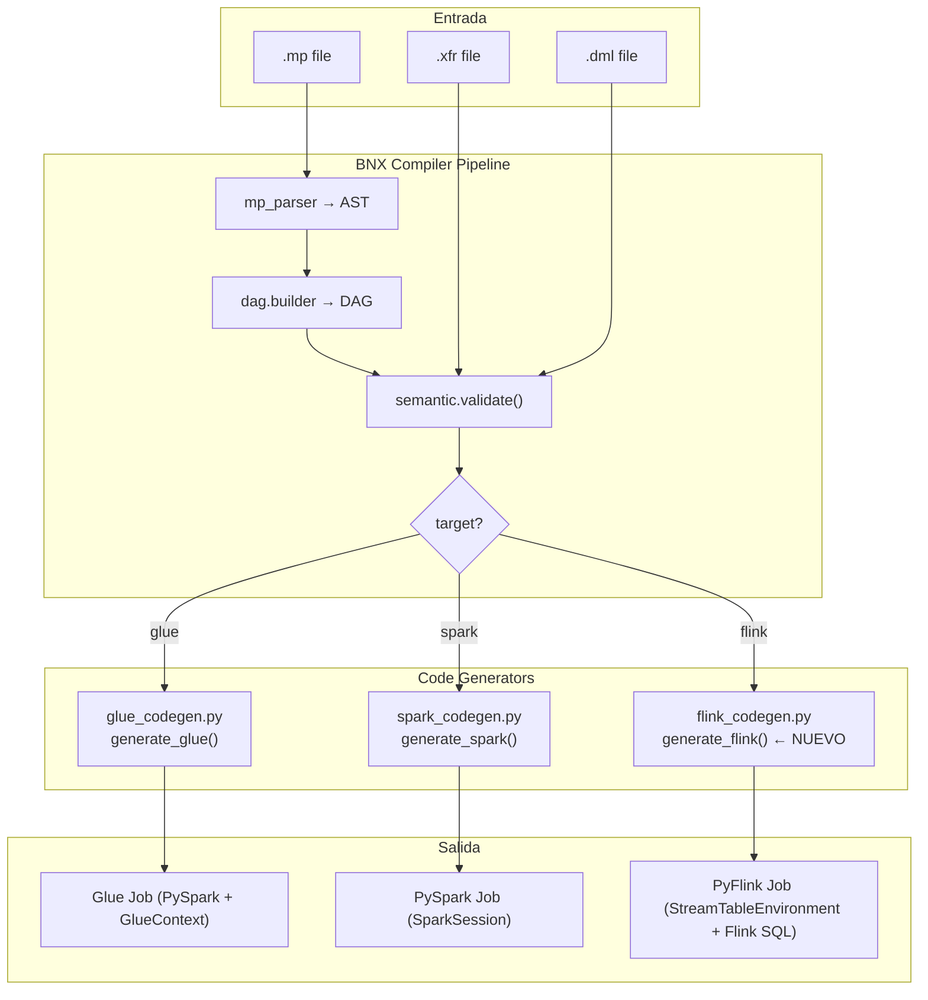
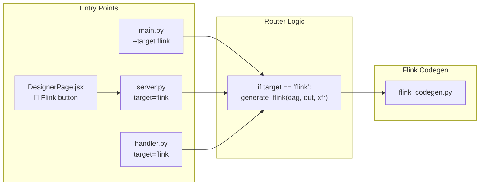
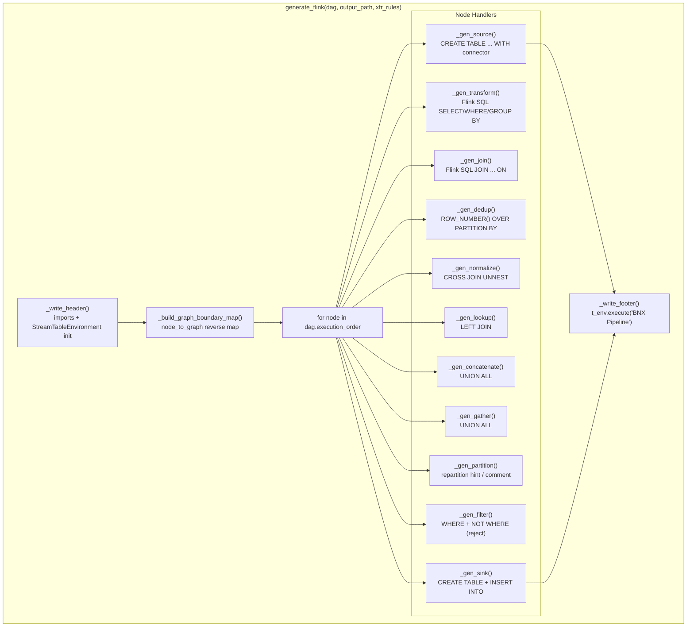

# Design Document — Flink Codegen

## Overview

Este documento describe el diseño para agregar Apache Flink como tercer target de generación de código al BNX Convertidor. El módulo `flink_codegen.py` seguirá el patrón arquitectónico establecido por `glue_codegen.py` y `spark_codegen.py`, generando código PyFlink que usa **Table API / Flink SQL** con `StreamTableEnvironment` como entorno de ejecución principal.

### Decisiones de Diseño Clave

1. **Flink SQL sobre DataStream API**: Se prioriza Flink SQL para todas las operaciones (SELECT, JOIN, GROUP BY, UNION ALL, ROW_NUMBER, UNNEST) porque es declarativo, más legible, y alineado con el patrón SQL-like que ya usan los XFR rules. DataStream API solo se menciona como import para interoperabilidad futura.

2. **Tablas temporales registradas**: A diferencia de Glue/Spark que usan DataFrames encadenados, Flink requiere registrar tablas con nombres en el `t_env`. Cada nodo genera una tabla registrada con `t_env.execute_sql()` o `t_env.create_temporary_view()`.

3. **Conectores via DDL**: Los SOURCE y SINK usan sentencias `CREATE TABLE ... WITH (...)` para definir conectores (kafka, filesystem, jdbc), que es el patrón estándar de PyFlink.

4. **Compatibilidad total**: No se modifica ninguna lógica existente de `generate_glue` ni `generate_spark`. Solo se agregan nuevos archivos y puntos de integración mínimos.

### Alcance

- Nuevo módulo `src/codegen/flink_codegen.py` con función `generate_flink(dag, output_path, xfr_rules=None)`
- Soporte para los 11 tipos de nodo: SOURCE, TRANSFORM, JOIN, DEDUP, NORMALIZE, LOOKUP, CONCATENATE, GATHER, PARTITION, FILTER, SINK
- Soporte Mega-DAG con graph boundaries
- Window operations (TUMBLE) para streaming con Kafka
- Integración con CLI (`main.py`), API (`server.py`), Lambda (`handler.py`), y UI (`DesignerPage.jsx`)

## Architecture

### High-Level Architecture



### Integration Points



### Low-Level Architecture — Flink Codegen Internals



## Components and Interfaces

### 1. `flink_codegen.py` — Módulo Principal

**Ubicación**: `src/codegen/flink_codegen.py`

**Interfaz pública**:

```python
def generate_flink(dag: DAG, output_path: str, xfr_rules: dict = None) -> None:
    """
    Genera un job PyFlink a partir del DAG.

    Args:
        dag: DAG con execution_order, nodes, y opcionalmente graph_boundaries
        output_path: Ruta del archivo .py de salida
        xfr_rules: Diccionario de reglas XFR por node_id o node_name
    """
```

**Funciones internas**:

```python
def _build_transform_sql(var_id: str, src_table: str, rule: dict, is_streaming_upstream: bool = False) -> str:
    """
    Genera sentencia Flink SQL para un nodo TRANSFORM.
    Soporta SELECT, WHERE, GROUP BY, y TUMBLE window para streaming.
    """

def _get_connector_ddl(name: str, connector_type: str, rule: dict, direction: str) -> str:
    """
    Genera DDL CREATE TABLE para conectores kafka/filesystem/jdbc.
    direction: 'source' o 'sink'
    """

def _is_streaming_upstream(node, dag, xfr_rules: dict) -> bool:
    """
    Determina si un nodo tiene un SOURCE upstream de tipo kafka (streaming).
    Recorre los padres recursivamente hasta encontrar un SOURCE.
    """
```

### 2. Puntos de Integración — Cambios Mínimos

**`main.py`** — Agregar `"flink"` a `choices` y branch en la lógica de generación:

```python
# Cambio en argparse
parser.add_argument("--target", choices=["glue", "spark", "flink"], default="glue")

# Cambio en main()
if target == "flink":
    generate_flink(dag, output_path, xfr_rules)
    print("🌊 Target: Apache Flink (PyFlink)")
elif target == "spark":
    ...
```

**`api/server.py`** — Agregar import y branch en cada endpoint:

```python
from src.codegen.flink_codegen import generate_flink

# En la lógica de generación de código:
if target == "flink":
    generate_flink(dag, out.name, xfr_rules)
elif target == "spark":
    generate_spark(dag, out.name, xfr_rules)
else:
    generate_glue(dag, out.name, xfr_rules)
```

**`lambda/handler.py`** — Mismo patrón en `_generate_code()` y `_build_response()`.

**`ui/src/components/DesignerPage.jsx`** — Agregar botón `"flink"` al target selector:

```jsx
{['glue', 'spark', 'flink'].map(tgt => (
  <button key={tgt} onClick={() => setTarget(tgt)} ...>
    {tgt === 'glue' ? '🔧 Glue' : tgt === 'spark' ? '⚡ Spark' : '🌊 Flink'}
  </button>
))}
```

### 3. Patrón de Generación por Tipo de Nodo

Cada tipo de nodo sigue este flujo:

1. **Leer regla XFR**: `rule = xfr_rules.get(var_id.lower()) or xfr_rules.get(log_name.lower())`
2. **Generar SQL/DDL**: Construir la sentencia Flink SQL apropiada
3. **Registrar tabla**: `t_env.execute_sql(sql)` o `t_env.create_temporary_view(name, result)`
4. **Escribir al archivo**: `f.write(...)` con comentarios y prints de log

### Detalle de SQL Generado por Tipo de Nodo

#### SOURCE (Kafka)
```sql
CREATE TABLE {var_id}_source (
    `value` STRING
) WITH (
    'connector' = 'kafka',
    'topic' = '{topic}',
    'properties.bootstrap.servers' = '{connection}',
    'scan.startup.mode' = 'earliest-offset',
    'format' = 'raw'
)
```

#### SOURCE (Filesystem — CSV)
```sql
CREATE TABLE {var_id}_source (
    `data` STRING
) WITH (
    'connector' = 'filesystem',
    'path' = '{path}',
    'format' = 'csv',
    'csv.field-delimiter' = ',',
    'csv.ignore-parse-errors' = 'true'
)
```

#### SOURCE (Filesystem — Parquet)
```sql
CREATE TABLE {var_id}_source (
    `data` STRING
) WITH (
    'connector' = 'filesystem',
    'path' = '{path}',
    'format' = 'parquet'
)
```

#### SOURCE (JDBC)
```sql
CREATE TABLE {var_id}_source (
    `data` STRING
) WITH (
    'connector' = 'jdbc',
    'url' = '{connection}',
    'table-name' = '{table}',
    'driver' = 'com.mysql.cj.jdbc.Driver'
)
```

#### TRANSFORM (simple)
```sql
CREATE TEMPORARY VIEW {var_id} AS
SELECT {select} FROM {parent_table} WHERE {where}
```

#### TRANSFORM (con GROUP BY — batch)
```sql
CREATE TEMPORARY VIEW {var_id} AS
SELECT {group_by_keys}, {agg_exprs} FROM {parent_table}
GROUP BY {group_by_keys}
```

#### TRANSFORM (con GROUP BY — streaming con TUMBLE)
```sql
CREATE TEMPORARY VIEW {var_id} AS
SELECT {group_by_keys}, {agg_exprs},
       window_start, window_end
FROM TABLE(TUMBLE(TABLE {parent_table}, DESCRIPTOR(event_time), INTERVAL '{window_size}' MINUTES))
GROUP BY {group_by_keys}, window_start, window_end
```

#### JOIN
```sql
CREATE TEMPORARY VIEW {var_id} AS
SELECT * FROM {parent1} {join_type} JOIN {parent2}
ON {parent1}.{join_key} = {parent2}.{join_key}
```

#### DEDUP (con order_by)
```sql
CREATE TEMPORARY VIEW {var_id} AS
SELECT * FROM (
    SELECT *, ROW_NUMBER() OVER (PARTITION BY {dedup_keys} ORDER BY {order_by} DESC) AS _rn
    FROM {parent_table}
) WHERE _rn = 1
```

#### DEDUP (sin order_by)
```sql
CREATE TEMPORARY VIEW {var_id} AS
SELECT DISTINCT {dedup_keys}, * FROM {parent_table}
```

#### NORMALIZE (explode array)
```sql
CREATE TEMPORARY VIEW {var_id} AS
SELECT *, {explode_col}_item
FROM {parent_table}
CROSS JOIN UNNEST({parent_table}.{explode_col}) AS T({explode_col}_item)
```

#### NORMALIZE (split string)
```sql
CREATE TEMPORARY VIEW {var_id} AS
SELECT *, part
FROM {parent_table}
CROSS JOIN UNNEST(STRING_TO_ARRAY({parent_table}.{split_col}, '{delimiter}')) AS T(part)
```

#### LOOKUP
```sql
CREATE TEMPORARY VIEW {var_id} AS
SELECT {main_cols}, {lookup_select}
FROM {parent1} LEFT JOIN {parent2}
ON {parent1}.{lookup_key} = {parent2}.{lookup_key}
```

#### CONCATENATE / GATHER
```sql
CREATE TEMPORARY VIEW {var_id} AS
SELECT * FROM {parent1}
UNION ALL
SELECT * FROM {parent2}
```

#### PARTITION
```python
# Flink SQL no tiene repartition explícito como Spark.
# Se genera un comentario indicando la intención de particionamiento.
# En producción, se configura via Flink job parallelism y key-by.
```

#### FILTER
```sql
-- Tabla filtrada
CREATE TEMPORARY VIEW {var_id} AS
SELECT * FROM {parent_table} WHERE {where}

-- Tabla de rechazos
CREATE TEMPORARY VIEW {var_id}_reject AS
SELECT * FROM {parent_table} WHERE NOT ({where})
```

#### SINK (Kafka)
```sql
CREATE TABLE {var_id}_sink (
    `value` STRING
) WITH (
    'connector' = 'kafka',
    'topic' = '{topic}',
    'properties.bootstrap.servers' = '{connection}',
    'format' = 'json'
)
-- Luego:
INSERT INTO {var_id}_sink SELECT * FROM {parent_table}
```

#### SINK (Filesystem)
```sql
CREATE TABLE {var_id}_sink (
    `data` STRING
) WITH (
    'connector' = 'filesystem',
    'path' = '{path}',
    'format' = '{format}'
)
INSERT INTO {var_id}_sink SELECT * FROM {parent_table}
```

#### SINK (JDBC)
```sql
CREATE TABLE {var_id}_sink (
    `data` STRING
) WITH (
    'connector' = 'jdbc',
    'url' = '{connection}',
    'table-name' = '{table}',
    'driver' = 'com.mysql.cj.jdbc.Driver'
)
INSERT INTO {var_id}_sink SELECT * FROM {parent_table}
```

## Data Models

### Estructuras de Entrada (sin cambios)

El módulo Flink codegen consume las mismas estructuras que Glue y Spark:

```python
# DAG (src/dag/builder.py)
class Node:
    id: str           # Identificador único del nodo
    name: str         # Nombre legible
    type: str         # SOURCE, TRANSFORM, JOIN, DEDUP, NORMALIZE, LOOKUP, CONCATENATE, GATHER, PARTITION, FILTER, SINK
    parents: list[str] # IDs de nodos padre
    children: list[str] # IDs de nodos hijo

class DAG:
    nodes: dict[str, Node]          # Mapa id → Node
    execution_order: list[Node]     # Orden topológico
    graph_boundaries: dict[str, list[str]]  # Mega-DAG: grafo → [node_ids]
```

```python
# XFR Rules (dict parseado de .xfr)
xfr_rules = {
    "node_name": {
        "select": "col1, col2, SUM(amount) as total",
        "where": "status = 'active'",
        "group_by": ["region", "category"],
        "join_key": "customer_id",
        "join_type": "left",
        "dedup_keys": ["id", "timestamp"],
        "order_by": "updated_at",
        "explode_col": "items",
        "split_col": "tags",
        "delimiter": ",",
        "lookup_key": "product_id",
        "lookup_select": "name, price",
        "source_type": "kafka",  # kafka | s3 | jdbc
        "sink_type": "kafka",    # kafka | s3 | jdbc
        "path": "s3://bucket/path",
        "format": "parquet",     # parquet | csv | json | avro
        "topic": "my-topic",
        "table": "my_table",
        "connection": "localhost:9092",
        "mode": "overwrite",     # overwrite | append
        "partition_keys": ["region"],
        "num_partitions": "4",
        "window_size": "5",      # NUEVO: tamaño de ventana TUMBLE en minutos (solo Flink)
    }
}
```

### Estructura de Salida

El código generado es un archivo `.py` con esta estructura:

```
1. Header (docstring + timestamp + versión BNX)
2. Imports (pyflink.table, pyflink.datastream, pyflink.table.expressions)
3. StreamTableEnvironment initialization
4. Graph boundary comments (si Mega-DAG)
5. Para cada nodo en execution_order:
   a. Comentario con tipo e ícono
   b. DDL CREATE TABLE (para SOURCE/SINK con conectores)
   c. SQL CREATE TEMPORARY VIEW (para transformaciones)
   d. Print de log
6. Footer (execute statement)
```

### Mapeo de Conceptos: Spark/Glue → Flink

| Concepto | Glue/Spark | Flink |
|----------|-----------|-------|
| Entry point | `SparkSession` / `GlueContext` | `StreamTableEnvironment` |
| Data abstraction | DataFrame | Table (registrada con nombre) |
| Read data | `spark.read.format(...)` | `CREATE TABLE ... WITH ('connector'=...)` |
| Transform | `df.selectExpr(...)` | `CREATE TEMPORARY VIEW ... AS SELECT ...` |
| Join | `df1.join(df2, on=..., how=...)` | `SELECT * FROM t1 JOIN t2 ON ...` |
| Dedup | `Window + row_number + filter` | `ROW_NUMBER() OVER (...) + WHERE _rn=1` |
| Explode | `explode(col(...))` | `CROSS JOIN UNNEST(...)` |
| Union | `df1.unionByName(df2)` | `SELECT * FROM t1 UNION ALL SELECT * FROM t2` |
| Filter | `df.where(...)` | `SELECT * FROM t WHERE ...` |
| Write data | `df.write.format(...)` | `CREATE TABLE sink ... WITH (...); INSERT INTO sink SELECT ...` |
| Streaming agg | N/A (micro-batch) | `TUMBLE(TABLE t, DESCRIPTOR(ts), INTERVAL '...')` |


## Correctness Properties

*A property is a characteristic or behavior that should hold true across all valid executions of a system — essentially, a formal statement about what the system should do. Properties serve as the bridge between human-readable specifications and machine-verifiable correctness guarantees.*

### Property 1: Structural Invariants of Generated Code

*For any* valid DAG (with at least one node), the generated PyFlink code SHALL contain: (a) import statements for `pyflink.table` and `pyflink.datastream`, (b) `StreamTableEnvironment` initialization, and (c) a header docstring with a timestamp and BNX version string.

**Validates: Requirements 1.2, 1.3, 1.5**

### Property 2: Node Coverage Completeness

*For any* valid DAG, every node in `dag.execution_order` SHALL have a corresponding code block in the generated output that references the node's name or id (via comment or SQL statement).

**Validates: Requirements 1.4**

### Property 3: SOURCE Connector Correctness

*For any* SOURCE node with an XFR rule specifying `source_type`, the generated code SHALL contain a `CREATE TABLE` DDL with the correct connector: `'connector' = 'kafka'` when source_type is "kafka" and topic is defined, `'connector' = 'filesystem'` when source_type is "s3" or undefined, and `'connector' = 'jdbc'` when source_type is "jdbc" with table or connection defined.

**Validates: Requirements 2.1, 2.2, 2.3**

### Property 4: TRANSFORM SQL Correctness

*For any* TRANSFORM node with XFR rules containing `select` and/or `where`, the generated Flink SQL SHALL include the specified columns in the SELECT clause and the specified condition in the WHERE clause. When `group_by` is present, the generated SQL SHALL include a GROUP BY clause with the specified keys.

**Validates: Requirements 3.1, 3.2**

### Property 5: JOIN Chained Correctness

*For any* JOIN node with N parents (N ≥ 2), the generated Flink SQL SHALL contain exactly N-1 JOIN clauses, using the `join_key` from XFR rules (defaulting to "id") and the `join_type` (defaulting to "INNER").

**Validates: Requirements 4.1, 4.4**

### Property 6: DEDUP ROW_NUMBER Correctness

*For any* DEDUP node with `dedup_keys` in XFR rules, the generated Flink SQL SHALL contain a `ROW_NUMBER() OVER (PARTITION BY {keys})` pattern with a `WHERE _rn = 1` filter. When `order_by` is specified, the ORDER BY clause SHALL use the specified column in DESC order.

**Validates: Requirements 5.1, 5.2**

### Property 7: NORMALIZE UNNEST for Array Explosion

*For any* NORMALIZE node with `explode_col` in XFR rules, the generated Flink SQL SHALL contain a `CROSS JOIN UNNEST` referencing the specified column name.

**Validates: Requirements 6.1**

### Property 8: NORMALIZE Split+UNNEST for String Splitting

*For any* NORMALIZE node with `split_col` and `delimiter` in XFR rules, the generated Flink SQL SHALL contain both a string splitting operation and an `UNNEST` referencing the specified column and delimiter.

**Validates: Requirements 6.2**

### Property 9: LOOKUP LEFT JOIN Correctness

*For any* LOOKUP node with 2 or more parents, the generated Flink SQL SHALL contain a `LEFT JOIN` between the first parent (main dataset) and the second parent (reference table), using the `lookup_key` as the ON condition. When `lookup_select` is specified, only those columns SHALL be selected from the reference table.

**Validates: Requirements 7.1, 7.2, 7.3**

### Property 10: UNION ALL Correctness for CONCATENATE and GATHER

*For any* CONCATENATE or GATHER node with N parents (N ≥ 2), the generated Flink SQL SHALL contain exactly N-1 `UNION ALL` clauses combining all parent tables.

**Validates: Requirements 8.1, 8.2**

### Property 11: FILTER Dual Output Correctness

*For any* FILTER node with a `where` condition in XFR rules, the generated code SHALL produce two views: one filtered view with the WHERE condition and one reject view with the negated condition `NOT ({where})`.

**Validates: Requirements 9.2**

### Property 12: SINK Connector Correctness

*For any* SINK node with a parent, the generated code SHALL contain a `CREATE TABLE` DDL with the correct connector (`kafka`, `filesystem`, or `jdbc` based on `sink_type`) followed by an `INSERT INTO` statement that selects from the parent table.

**Validates: Requirements 10.1, 10.2, 10.3**

### Property 13: Graph Boundary Comments in Mega-DAG

*For any* DAG with `graph_boundaries` defined, the generated code SHALL insert a `# === GRAPH: {name} ===` comment whenever the current node belongs to a different graph than the previous node in execution order.

**Validates: Requirements 11.1**

### Property 14: Streaming Window Conditional

*For any* TRANSFORM node with `group_by` in XFR rules, the generated SQL SHALL use a `TUMBLE` window function if and only if the upstream source is of type "kafka" (streaming). When the upstream is not streaming, a standard `GROUP BY` without TUMBLE SHALL be generated.

**Validates: Requirements 12.1, 12.2, 12.3**

### Property 15: Backward Compatibility of Existing Generators

*For any* valid DAG and XFR rules, invoking `generate_glue` and `generate_spark` SHALL produce identical output before and after the addition of the Flink codegen module — no existing generator logic is modified.

**Validates: Requirements 17.1**

## Error Handling

### Errores en Generación de Código

| Escenario | Comportamiento |
|-----------|---------------|
| Nodo TRANSFORM sin padre | Genera comentario `# ⚠️ TRANSFORM {name} has no parent` y asigna `None` |
| Nodo SINK sin padre | Genera comentario `# ⚠️ SINK {name} has no parent — nothing to write` |
| Nodo JOIN con < 2 padres | Si tiene 1 padre, asigna directamente la tabla del padre. Si tiene 0, asigna `None` |
| Nodo LOOKUP con < 2 padres | Si tiene 1 padre, asigna directamente. Si tiene 0, asigna `None` |
| Nodo NORMALIZE sin config explode/split | Pasa datos sin transformación (passthrough) |
| Nodo FILTER sin condición where | Pasa datos sin filtrar; genera tabla de rechazos vacía |
| Nodo DEDUP sin dedup_keys | Usa `["id"]` como keys por defecto |
| Nodo JOIN sin join_key | Usa `"id"` como key por defecto |
| Nodo JOIN sin join_type | Usa `"INNER"` como tipo por defecto |
| XFR rule no encontrada para un nodo | Genera `SELECT *` desde el padre (passthrough) |
| Tipo de nodo desconocido | Genera bloque genérico con `SELECT *` y comentario indicando el tipo |

### Errores de Validación (sin cambios)

El validador semántico (`src/validator/semantic.py`) ya detecta errores antes de la generación de código. No se requieren cambios al validador — los mismos errores y warnings aplican para Flink.

### Manejo de Conectores

- Si `source_type` o `sink_type` no es reconocido, se usa `filesystem` como fallback
- Si `connection` no está definida para Kafka, se usa `"localhost:9092"` como default
- Si `connection` no está definida para JDBC, se usa `"jdbc:mysql://localhost:3306/db"` como default
- Si `path` no está definido para filesystem, se genera un path basado en el node_id: `s3://bnx/raw/{var_id}` (source) o `s3://bnx/output/{var_id}` (sink)

## Testing Strategy

### Enfoque Dual: Unit Tests + Property-Based Tests

Este feature es ideal para property-based testing porque:
- `generate_flink` es una función pura (DAG + rules → string de código)
- El espacio de entrada es grande (combinaciones de tipos de nodo, reglas XFR, topologías de DAG)
- Las propiedades son universales (aplican para cualquier DAG válido)

### Property-Based Testing

**Library**: [Hypothesis](https://hypothesis.readthedocs.io/) (Python)

**Configuración**: Mínimo 100 iteraciones por propiedad.

**Generators necesarios**:
- `dag_generator()`: Genera DAGs válidos con nodos aleatorios, tipos variados, y conexiones válidas (respetando orden topológico)
- `xfr_rule_generator(node_type)`: Genera reglas XFR válidas según el tipo de nodo
- `source_rule_generator()`: Genera reglas SOURCE con source_type aleatorio (kafka/s3/jdbc), paths, topics, connections
- `sink_rule_generator()`: Genera reglas SINK con sink_type aleatorio, paths, topics, connections
- `transform_rule_generator()`: Genera reglas TRANSFORM con select, where, group_by aleatorios
- `mega_dag_generator()`: Genera DAGs con graph_boundaries para testing de Mega-DAG

**Tag format**: Cada test debe incluir un comentario con:
```python
# Feature: flink-codegen, Property {N}: {property_text}
```

**Properties a implementar** (15 properties, cada una como un test PBT individual):

1. **Structural invariants** — Genera DAGs aleatorios, verifica imports + init + header
2. **Node coverage** — Genera DAGs aleatorios, verifica que cada nodo tiene código
3. **SOURCE connector** — Genera SOURCE nodes con tipos aleatorios, verifica conector correcto
4. **TRANSFORM SQL** — Genera TRANSFORM nodes con reglas aleatorias, verifica SQL
5. **JOIN chained** — Genera JOIN nodes con N padres, verifica N-1 JOINs
6. **DEDUP ROW_NUMBER** — Genera DEDUP nodes con keys aleatorias, verifica patrón
7. **NORMALIZE UNNEST** — Genera NORMALIZE nodes con explode_col, verifica UNNEST
8. **NORMALIZE split** — Genera NORMALIZE nodes con split_col, verifica split+UNNEST
9. **LOOKUP LEFT JOIN** — Genera LOOKUP nodes, verifica LEFT JOIN con key y select
10. **UNION ALL** — Genera CONCATENATE/GATHER con N padres, verifica N-1 UNION ALL
11. **FILTER dual output** — Genera FILTER nodes con where, verifica ambas vistas
12. **SINK connector** — Genera SINK nodes con tipos aleatorios, verifica conector + INSERT INTO
13. **Graph boundaries** — Genera Mega-DAGs, verifica comentarios de boundary
14. **Streaming window** — Genera DAGs con/sin Kafka upstream, verifica TUMBLE condicional
15. **Backward compatibility** — Genera DAGs, verifica que glue/spark output no cambia

### Unit Tests (Example-Based)

Tests específicos para escenarios concretos y edge cases:

| Test | Tipo | Descripción |
|------|------|-------------|
| `test_source_csv_format` | Example | SOURCE con format=csv genera opciones CSV |
| `test_source_parquet_default` | Example | SOURCE sin format usa parquet |
| `test_transform_no_rule` | Example | TRANSFORM sin XFR genera SELECT * |
| `test_transform_no_parent` | Edge case | TRANSFORM sin padre genera comentario |
| `test_join_default_key` | Example | JOIN sin join_key usa "id" |
| `test_join_default_type` | Example | JOIN sin join_type usa INNER |
| `test_dedup_default_keys` | Example | DEDUP sin dedup_keys usa ["id"] |
| `test_normalize_no_config` | Edge case | NORMALIZE sin config hace passthrough |
| `test_concatenate_single_parent` | Edge case | CONCATENATE con 1 padre asigna directo |
| `test_filter_no_where` | Edge case | FILTER sin where hace passthrough |
| `test_sink_no_parent` | Edge case | SINK sin padre genera comentario |
| `test_cli_target_flink` | Example | CLI acepta --target flink |
| `test_cli_flink_message` | Example | CLI imprime "🌊 Target: Apache Flink (PyFlink)" |
| `test_default_target_glue` | Example | Sin target usa Glue por defecto |

### Integration Tests

| Test | Descripción |
|------|-------------|
| `test_api_compile_flink` | POST /compile con target=flink retorna código PyFlink |
| `test_api_cobol_flink` | POST /cobol con target=flink retorna código PyFlink |
| `test_api_plan_flink` | POST /plan con target=flink retorna código PyFlink |
| `test_lambda_flink` | Lambda handler con target=flink invoca generate_flink |
| `test_e2e_simple_dag` | DAG simple (SOURCE→TRANSFORM→SINK) genera código Flink ejecutable |
| `test_e2e_mega_dag` | Mega-DAG con graph boundaries genera código Flink con comentarios |

### Estructura de Tests

```
tests/
  test_flink_codegen.py          # Unit tests + property tests para flink_codegen
  test_flink_integration.py      # Integration tests para CLI/API/Lambda
  conftest.py                    # Fixtures compartidos (DAG builders, rule generators)
```
