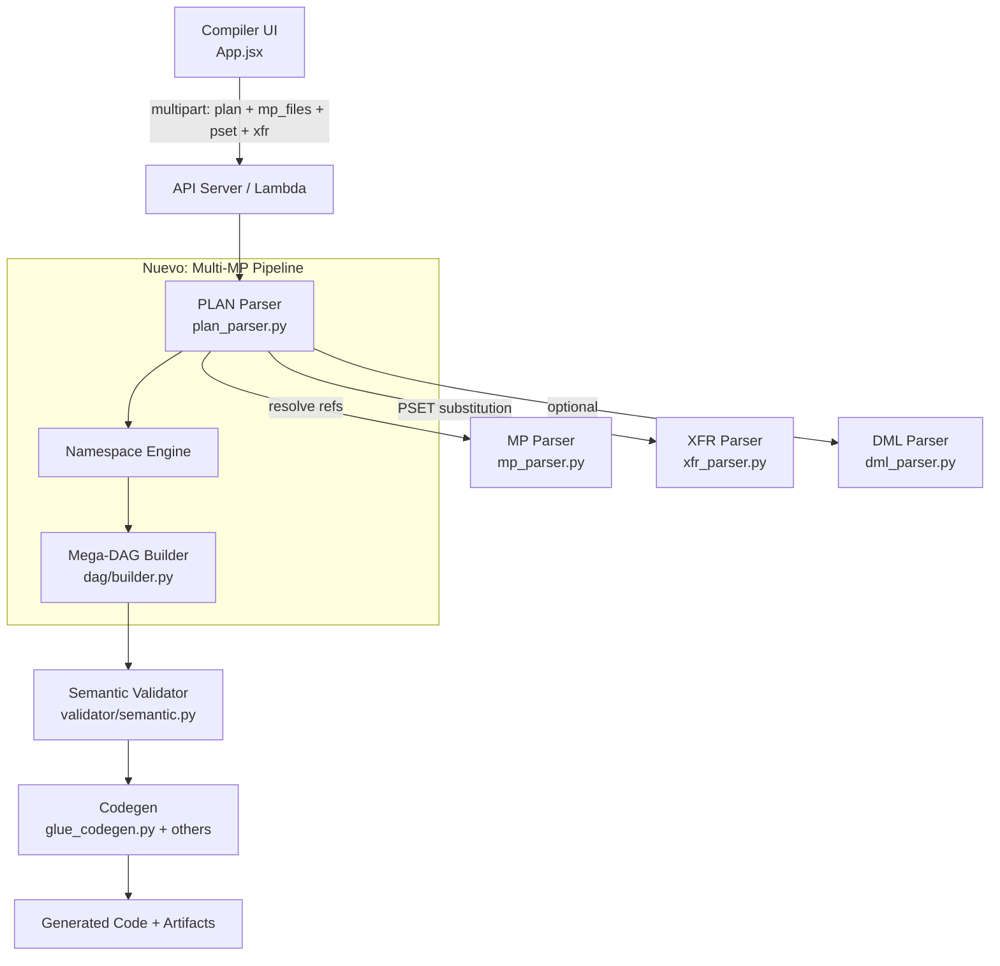
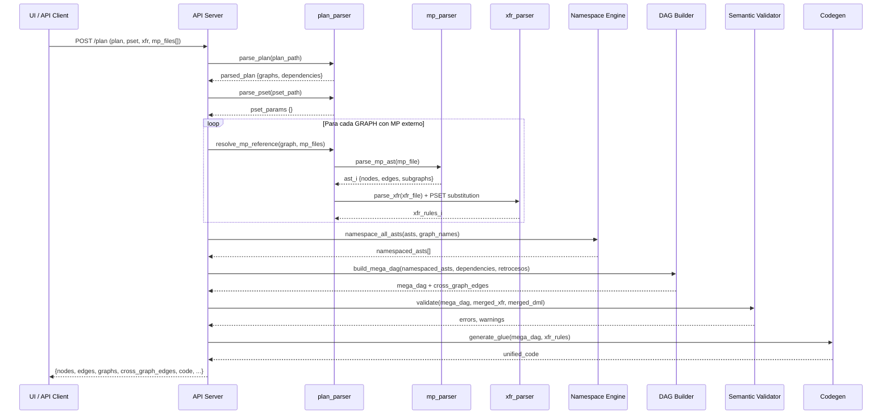

# Design Document — Grafo de Grafos

## Overview

La funcionalidad "Grafo de Grafos" extiende el compilador BNX para soportar PLANs que referencian múltiples archivos `.mp` externos. Actualmente, `plan_to_graph()` genera un único `.mp` sintético a partir de las definiciones del PLAN. Con esta extensión, cada GRAPH en el PLAN puede apuntar a un archivo `.mp` real (con su `.xfr` y `.dml` opcionales), y el sistema los combina en un **Mega-DAG** unificado con:

- **Namespacing** de nodos para evitar colisiones entre grafos
- **Cross-graph edges** (SINK→SOURCE) para dependencias inter-grafo
- **Retrocesos** (feedback loops) con lógica de checkpoint/staging
- **Sustitución PSET** transversal a todos los grafos
- **Compatibilidad hacia atrás** con los flujos existentes de single-MP y PLAN sin archivos externos

El Mega-DAG resultante pasa por validación semántica extendida y genera código unificado (Glue/Spark/StepFunctions/Terraform/Airflow) como un solo job orquestado.

## Architecture

### High-Level Architecture



### Flujo de datos detallado



## Components and Interfaces

### High-Level Design — Componentes principales

| Componente | Archivo | Responsabilidad |
|---|---|---|
| PLAN Parser (extendido) | `src/plan_parser.py` | Resolución de refs MP/XFR/DML, detección de retrocesos, sustitución PSET |
| Namespace Engine (nuevo) | `src/plan_parser.py` (función interna) | Prefijado de node IDs con `{graph_name}__` |
| Mega-DAG Builder (extendido) | `src/dag/builder.py` | Merge de ASTs, creación de cross-graph edges, topo sort con feedback edges excluidos |
| Semantic Validator (extendido) | `src/validator/semantic.py` | Validación cross-graph, propagación de columnas inter-grafo |
| Codegen (extendido) | `src/codegen/glue_codegen.py` + otros | Generación unificada con comentarios de boundary, lógica de retroceso |
| API Server (extendido) | `api/server.py` | Endpoint `/plan` acepta `mp_files` múltiples |
| Lambda Handler (extendido) | `lambda/handler.py` | Mismo soporte multi-MP |
| Compiler UI (extendido) | `ui/src/App.jsx` | Upload múltiple de `.mp`, visualización de cross-graph edges |
| MP Pretty-Printer (nuevo) | `src/plan_parser.py` (función) | Serialización del Mega-DAG a formato `.mp` |

### Low-Level Design — Interfaces y firmas

#### `src/plan_parser.py` — Funciones nuevas/modificadas

```python
def resolve_graph_references(
    parsed_plan: dict,
    mp_files: dict[str, str],   # {filename: temp_path}
    pset_params: dict[str, str],
    base_dir: str | None = None
) -> list[ResolvedGraph]:
    """
    Para cada GRAPH en el PLAN:
    1. Si tiene MP property y existe en mp_files → parse_mp_ast(path)
    2. Si tiene MP property pero no existe → error descriptivo
    3. Si no tiene MP property → auto-generate con plan_to_graph logic
    4. Sustituye PSET params en XFR content
    Retorna lista de ResolvedGraph con ast, xfr_rules, dml_schema por grafo.
    """
    ...

def detect_retrocesos(
    parsed_plan: dict
) -> list[tuple[str, str]]:
    """
    Analiza el grafo de dependencias entre GRAPHs.
    Detecta backward references (ciclos) y los marca como retrocesos.
    Retorna lista de (from_graph, to_graph) que son feedback loops.
    """
    ...

def namespace_ast(
    ast: dict,
    graph_name: str
) -> dict:
    """
    Prefija todos los node IDs y edge references con '{graph_name}__'.
    Preserva el nombre original en node['name'] (display name).
    Renombra subgraphs a '{graph_name}__{subgraph_name}'.
    """
    ...

def merge_asts(
    resolved_graphs: list[ResolvedGraph],
    dependencies: dict[str, list[str]],
    retrocesos: list[tuple[str, str]]
) -> dict:
    """
    Combina todos los ASTs namespaciados en un único AST unificado.
    Crea cross-graph edges (SINK→SOURCE) basados en dependencies.
    Marca edges de retroceso con metadata.
    Retorna: {
        "nodes": [...all nodes...],
        "edges": [...all edges + cross-graph edges...],
        "subgraphs": {...graph_name: [node_ids]...},
        "cross_graph_edges": [...],
        "retroceso_edges": [...]
    }
    """
    ...

def substitute_pset_params(
    content: str,
    pset_params: dict[str, str]
) -> str:
    """
    Reemplaza ${PARAM_NAME} en content con valores del PSET.
    Loguea warning si un parámetro referenciado no está definido.
    """
    ...

def pretty_print_mega_dag(
    merged_ast: dict
) -> str:
    """
    Serializa el Mega-DAG a formato .mp legible.
    Incluye SUBGRAPH blocks por cada grafo original.
    Marca cross-graph edges con comentarios.
    """
    ...
```

#### `src/dag/builder.py` — Funciones nuevas/modificadas

```python
def build_mega_dag(
    merged_ast: dict
) -> DAG:
    """
    Construye el DAG desde el AST unificado.
    Excluye retroceso_edges del topo sort.
    Preserva metadata de cross-graph edges y retrocesos en el DAG.
    """
    ...

# La clase DAG se extiende con:
class DAG:
    # ... campos existentes ...
    cross_graph_edges: list[dict]    # [{from, to, source_graph, target_graph}]
    retroceso_edges: list[dict]      # [{from, to, source_graph, target_graph}]
    graph_boundaries: dict[str, list[str]]  # {graph_name: [node_ids]}
```

#### `src/validator/semantic.py` — Funciones nuevas/modificadas

```python
def validate(
    dag: DAG,
    xfr_rules: dict,
    dml_schema: dict | None = None
) -> tuple[list[str], list[str]]:
    """
    Extendido para:
    1. Validar cross-graph edges (nodos existen en grafos correctos)
    2. Propagar columnas a través de cross-graph edges (SINK→SOURCE)
    3. Validar retrocesos (solo SINK→SOURCE, iteration limit definido)
    4. Mantener validación intra-grafo existente
    """
    ...

def _infer_columns_cross_graph(
    node: Node,
    dag: DAG,
    xfr_rules: dict,
    col_cache: dict,
    dml_schema: dict | None = None
) -> set:
    """
    Extiende _infer_columns para SOURCE nodes que reciben datos
    de un cross-graph edge: hereda columnas del SINK padre en otro grafo.
    """
    ...
```

#### `src/codegen/glue_codegen.py` — Funciones nuevas/modificadas

```python
def generate_glue(
    dag: DAG,
    output_path: str,
    xfr_rules: dict = None
) -> None:
    """
    Extendido para:
    1. Insertar comentarios de boundary entre grafos
       # === GRAPH: {graph_name} ===
    2. Generar lógica de checkpoint/staging para retrocesos
    3. Generar iteration loop para feedback edges
    """
    ...
```

#### `api/server.py` — Endpoint modificado

```python
@app.post("/plan")
async def convert_plan(
    plan: UploadFile = File(...),
    pset: Optional[UploadFile] = File(None),
    xfr: Optional[UploadFile] = File(None),
    mp_files: list[UploadFile] = File(default=[]),  # NUEVO
    target: str = "glue",
) -> dict:
    """
    Extendido para aceptar mp_files[].
    Retorna campos adicionales:
    - graphs: [{name, nodes, edges, subgraphs}]
    - cross_graph_edges: [{from, to, source_graph, target_graph, type}]
    """
    ...
```

#### `lambda/handler.py` — Handler modificado

```python
# En el bloque /plan:
# Extraer mp_files del multipart (campos mp_file_0, mp_file_1, ... o mp_files[])
# Pasar a resolve_graph_references()
```

#### `ui/src/App.jsx` — Cambios UI

```jsx
// Nuevo state:
const [mpFiles, setMpFiles] = useState([])  // lista de File objects
const mpFilesRef = useRef(null)

// Nuevo upload control en sección Ab Initio PLAN:
// Botón "4° 📦 .mp files" que acepta multiple
// Lista de archivos subidos con botón de eliminar individual

// En compilePlan():
// Adjuntar cada mp file al FormData como mp_files
```

#### `ui/src/components/DagViewer.jsx` — Cambios visualización

```jsx
// Extender buildLayout() para:
// 1. Agrupar nodos por subgraph (graph boundary)
// 2. Renderizar cross-graph edges como líneas dashed
// 3. Renderizar retroceso edges como líneas rojas dashed con flecha

// Nuevo estilo para cross-graph edges:
const crossGraphEdgeStyle = {
    stroke: '#8b5cf6',
    strokeWidth: 2,
    strokeDasharray: '8 4',
}

// Nuevo estilo para retroceso edges:
const retrocedoEdgeStyle = {
    stroke: '#ef4444',
    strokeWidth: 2,
    strokeDasharray: '6 3',
    animated: true,
}
```

### Dataclass auxiliar

```python
# src/plan_parser.py
from dataclasses import dataclass, field

@dataclass
class ResolvedGraph:
    """Representa un grafo individual resuelto desde el PLAN."""
    name: str
    ast: dict                          # {nodes, edges, subgraphs}
    xfr_rules: dict = field(default_factory=dict)
    dml_schema: dict = field(default_factory=dict)
    is_auto_generated: bool = False    # True si no tenía MP externo
    depends: list[str] = field(default_factory=list)
```


## Data Models

### Mega-DAG AST (merged_ast)

Estructura resultante de `merge_asts()`:

```python
merged_ast = {
    "nodes": [
        {
            "id": "ingest_tx__read_csv",        # namespaced ID
            "name": "read_csv",                  # display name original
            "type": "SOURCE",
            "params": "",
            "subgraph": "ingest_tx",             # graph de origen
            "source_graph": "ingest_tx",         # metadata de grafo
        },
        # ... más nodos de todos los grafos
    ],
    "edges": [
        {"from": "ingest_tx__read_csv", "to": "ingest_tx__clean_data"},  # intra-graph
        {"from": "ingest_tx__write_out", "to": "enrich__read_enriched",  # cross-graph
         "cross_graph": True, "source_graph": "ingest_tx", "target_graph": "enrich"},
    ],
    "subgraphs": {
        "ingest_tx": ["ingest_tx__read_csv", "ingest_tx__clean_data", "ingest_tx__write_out"],
        "enrich": ["enrich__read_enriched", "enrich__join_ref", "enrich__write_final"],
    },
    "cross_graph_edges": [
        {
            "from": "ingest_tx__write_out",
            "to": "enrich__read_enriched",
            "source_graph": "ingest_tx",
            "target_graph": "enrich",
            "type": "normal"  # o "retroceso"
        }
    ],
    "retroceso_edges": [
        {
            "from": "enrich__feedback_sink",
            "to": "ingest_tx__feedback_source",
            "source_graph": "enrich",
            "target_graph": "ingest_tx",
            "max_iterations": 5,
            "convergence_check": "delta < 0.01"
        }
    ]
}
```

### DAG extendido

```python
class DAG:
    nodes: dict[str, Node]                    # {node_id: Node}
    execution_order: list[Node]               # topo sort (sin retrocesos)
    cross_graph_edges: list[dict]             # edges entre grafos
    retroceso_edges: list[dict]               # feedback loops
    graph_boundaries: dict[str, list[str]]    # {graph_name: [node_ids]}
```

### API Response extendida (endpoint `/plan`)

```json
{
    "nodes": [...],
    "edges": [...],
    "subgraphs": ["ingest_tx", "enrich", "report"],
    "errors": [],
    "warnings": [],
    "code": "...",
    "stepfunctions": "...",
    "terraform": "...",
    "airflow": "...",
    "accuracy": {...},
    "generated_mp": "...",
    "generated_xfr": "...",
    "plan_name": "banking_pipeline",
    "pset_params": {...},
    "graphs": [
        {
            "name": "ingest_tx",
            "nodes": [...],
            "edges": [...],
            "is_auto_generated": false
        }
    ],
    "cross_graph_edges": [
        {
            "from": "ingest_tx__write_out",
            "to": "enrich__read_enriched",
            "source_graph": "ingest_tx",
            "target_graph": "enrich",
            "type": "normal"
        }
    ]
}
```

### Formato PLAN extendido (ejemplo)

```
PLAN banking_pipeline
VERSION 2.0

GRAPH ingest_tx
  MP: graphs/ingest_transactions.mp
  XFR: graphs/ingest_transactions.xfr
  DML: schemas/transactions.dml
  PRIORITY: HIGH

GRAPH enrich
  MP: graphs/enrich_data.mp
  XFR: graphs/enrich_data.xfr
  DEPENDS: ingest_tx

GRAPH risk_score
  MP: graphs/risk_scoring.mp
  DEPENDS: enrich
  ON_FAILURE: notify_ops

GRAPH report
  DEPENDS: risk_score, enrich
  ON_SUCCESS: archive

GRAPH feedback_loop
  MP: graphs/feedback.mp
  DEPENDS: report, ingest_tx
  # Esto crea un retroceso: feedback_loop depende de ingest_tx,
  # pero report (del que depende feedback_loop) también depende
  # transitivamente de ingest_tx
```

### Algoritmo de detección de retrocesos

```python
def detect_retrocesos(parsed_plan: dict) -> list[tuple[str, str]]:
    """
    1. Construir grafo dirigido de dependencias entre GRAPHs
    2. Para cada edge (A depends on B), verificar si B también
       depende (directa o transitivamente) de A
    3. Si sí → es un retroceso (A, B)
    4. Retornar lista de retrocesos
    """
    graphs = parsed_plan["graphs"]
    retrocesos = []

    # Construir adjacency list
    adj = {name: g["depends"] for name, g in graphs.items()}

    def can_reach(start, target, visited=None):
        if visited is None:
            visited = set()
        if start == target:
            return True
        if start in visited:
            return False
        visited.add(start)
        for dep in adj.get(start, []):
            if can_reach(dep, target, visited):
                return True
        return False

    for name, g in graphs.items():
        for dep in g["depends"]:
            if dep in graphs and can_reach(dep, name):
                retrocesos.append((name, dep))

    return retrocesos
```

### Algoritmo de namespacing

```python
def namespace_ast(ast: dict, graph_name: str) -> dict:
    prefix = f"{graph_name}__"

    # Crear mapping de IDs originales a namespaciados
    id_map = {}
    new_nodes = []
    for node in ast["nodes"]:
        new_id = prefix + node["id"]
        id_map[node["id"]] = new_id
        new_nodes.append({
            **node,
            "id": new_id,
            "name": node["name"],  # preservar display name
            "subgraph": graph_name,
            "source_graph": graph_name,
        })

    new_edges = []
    for edge in ast["edges"]:
        new_edges.append({
            "from": id_map.get(edge["from"], prefix + edge["from"]),
            "to": id_map.get(edge["to"], prefix + edge["to"]),
        })

    new_subgraphs = {}
    for sg_name, node_ids in ast.get("subgraphs", {}).items():
        new_sg_name = f"{graph_name}__{sg_name}"
        new_subgraphs[new_sg_name] = [id_map.get(nid, prefix + nid) for nid in node_ids]
    # Agregar el grafo completo como subgraph
    new_subgraphs[graph_name] = [n["id"] for n in new_nodes]

    return {
        "nodes": new_nodes,
        "edges": new_edges,
        "subgraphs": new_subgraphs,
    }
```

### Algoritmo de cross-graph edge creation

```python
def _create_cross_graph_edges(
    resolved_graphs: list[ResolvedGraph],
    dependencies: dict[str, list[str]],
    retrocesos: list[tuple[str, str]]
) -> list[dict]:
    """
    Para cada dependencia (graph_A depends on graph_B):
    1. Encontrar nodos SINK en graph_B (namespaciados)
    2. Encontrar nodos SOURCE en graph_A (namespaciados)
    3. Crear edge SINK→SOURCE
    4. Marcar como 'retroceso' si (graph_A, graph_B) está en retrocesos
    """
    cross_edges = []
    retroceso_set = set(retrocesos)

    graph_map = {g.name: g for g in resolved_graphs}

    for graph_name, deps in dependencies.items():
        g = graph_map.get(graph_name)
        if not g:
            continue
        target_sources = [
            n for n in g.ast["nodes"] if n["type"].upper() == "SOURCE"
        ]

        for dep_name in deps:
            dep_g = graph_map.get(dep_name)
            if not dep_g:
                continue
            dep_sinks = [
                n for n in dep_g.ast["nodes"] if n["type"].upper() == "SINK"
            ]

            edge_type = "retroceso" if (graph_name, dep_name) in retroceso_set else "normal"

            # Conectar cada SINK del dep con cada SOURCE del dependiente
            for sink in dep_sinks:
                for source in target_sources:
                    cross_edges.append({
                        "from": sink["id"],
                        "to": source["id"],
                        "source_graph": dep_name,
                        "target_graph": graph_name,
                        "type": edge_type,
                    })

    return cross_edges
```

### Lógica de retroceso en codegen

```python
# Pseudocódigo para generación de iteration loop
def _generate_retroceso_code(retroceso_edges, max_iterations=5):
    """
    for iteration in range(max_iterations):
        # Ejecutar grafos en orden topológico
        # Para cada retroceso edge:
        #   - Escribir output a staging path: s3://staging/{graph}_{iteration}/
        #   - En siguiente iteración, SOURCE lee de staging
        # Convergence check: si delta < threshold, break
    """
    ...
```


## Correctness Properties

*A property is a characteristic or behavior that should hold true across all valid executions of a system — essentially, a formal statement about what the system should do. Properties serve as the bridge between human-readable specifications and machine-verifiable correctness guarantees.*

### Property 1: External reference resolution

*For any* PLAN with GRAPH definitions that have MP/XFR/DML properties referencing files, and a matching set of provided files, `resolve_graph_references` SHALL produce a `ResolvedGraph` for each GRAPH where: (a) graphs with external MP have their AST loaded from the file, (b) graphs without MP have `is_auto_generated=True`, and (c) graphs with missing MP files produce a descriptive error containing the graph name and file path.

**Validates: Requirements 1.1, 1.2, 1.3, 1.4, 1.5**

### Property 2: Namespace correctness

*For any* AST and any valid graph name, applying `namespace_ast` SHALL produce an AST where: (a) every node ID starts with `{graph_name}__`, (b) every edge references only namespaced IDs, (c) every node's display `name` field equals its original pre-namespace name, and (d) two ASTs namespaced with different graph names have zero node ID collisions.

**Validates: Requirements 2.2, 2.3, 2.4**

### Property 3: Merge preserves all nodes and subgraph structure

*For any* set of namespaced ASTs, `merge_asts` SHALL produce a unified AST where: (a) the total number of nodes equals the sum of nodes across all input ASTs, (b) all intra-graph edges from each input appear in the output, and (c) each original graph name appears as a subgraph key containing exactly its namespaced node IDs.

**Validates: Requirements 3.1, 3.3**

### Property 4: Topological order validity

*For any* Mega-DAG without non-retroceso cycles, the `execution_order` SHALL be a valid topological sort: for every non-retroceso edge (A → B), node A appears before node B in the execution order.

**Validates: Requirements 3.4**

### Property 5: Non-retroceso cycle detection

*For any* dependency graph between GRAPHs that contains a cycle not marked as a retroceso, `build_mega_dag` SHALL return an error indicating the cycle path.

**Validates: Requirements 3.5**

### Property 6: Retroceso detection

*For any* PLAN dependency graph where graph A depends on graph B and B transitively depends on A, `detect_retrocesos` SHALL identify (A, B) as a retroceso pair.

**Validates: Requirements 4.1**

### Property 7: Retroceso edges excluded from topological sort

*For any* Mega-DAG containing retroceso edges, the topological sort SHALL succeed (no cycle error), and retroceso edges SHALL not constrain the ordering of nodes in `execution_order`.

**Validates: Requirements 4.2**

### Property 8: Retroceso boundary validation

*For any* retroceso edge in the Mega-DAG, the Semantic Validator SHALL accept it only if it connects a SINK node in one graph to a SOURCE node in a different graph. Retroceso edges within a single graph SHALL produce a validation error.

**Validates: Requirements 4.3**

### Property 9: PSET parameter substitution

*For any* XFR content string containing `${PARAM}` references and any PSET dictionary, `substitute_pset_params` SHALL replace every `${PARAM}` whose key exists in the PSET with its corresponding value, and leave `${PARAM}` references for undefined keys unchanged.

**Validates: Requirements 5.2**

### Property 10: Warning on undefined PSET parameter

*For any* XFR content containing `${PARAM}` references where PARAM is not defined in the PSET, the system SHALL produce a warning that includes both the undefined parameter name and the graph name where it is referenced.

**Validates: Requirements 5.4**

### Property 11: Cross-graph edge validation

*For any* cross-graph edge in the Mega-DAG, the Semantic Validator SHALL verify that the source node exists in the dependency graph and the target node exists in the dependent graph. Edges referencing non-existent nodes SHALL produce a validation error.

**Validates: Requirements 8.2, 8.4**

### Property 12: Column inference propagation across cross-graph edges

*For any* cross-graph edge connecting a SINK in graph A to a SOURCE in graph B, the column inference for the SOURCE node in graph B SHALL include the columns inferred from the SINK node in graph A.

**Validates: Requirements 8.3**

### Property 13: Retroceso iteration limit validation

*For any* retroceso edge in the Mega-DAG, the Semantic Validator SHALL verify that the retroceso has a defined maximum iteration count or termination condition. Retrocesos without these SHALL produce a validation error.

**Validates: Requirements 8.5**

### Property 14: Graph boundary comments in generated code

*For any* valid Mega-DAG with N graphs (N > 1), the generated Glue/Spark code SHALL contain exactly N boundary comment markers of the form `# === GRAPH: {graph_name} ===`, one for each graph in the Mega-DAG.

**Validates: Requirements 9.2**

### Property 15: Mixed MP resolution backward compatibility

*For any* PLAN where some GRAPHs have external MP references and others do not, `resolve_graph_references` SHALL use external files for graphs with MP properties and auto-generate for graphs without, producing a valid `ResolvedGraph` for every GRAPH in the PLAN.

**Validates: Requirements 10.3**

### Property 16: Mega-DAG serialization round-trip

*For any* valid Mega-DAG structure, `parse_mp_ast(pretty_print_mega_dag(mega_dag))` SHALL produce an AST equivalent to the original: same set of node IDs, same set of edges, and same subgraph membership.

**Validates: Requirements 11.1, 11.2, 11.3**

## Error Handling

### Errores fatales (bloquean compilación)

| Error | Origen | Mensaje |
|---|---|---|
| MP file no encontrado | `resolve_graph_references` | `"GRAPH '{name}': MP file '{path}' not found or unreadable"` |
| Ciclo no-retroceso en dependencias | `build_mega_dag` | `"Cycle detected in GRAPH dependencies: {cycle_path}. Mark as retroceso if intentional."` |
| Cross-graph edge a nodo inexistente | `validate` | `"Cross-graph edge from '{from_node}' to '{to_node}': target node not found in graph '{graph_name}'"` |
| Retroceso intra-grafo | `validate` | `"Retroceso edge '{from}' → '{to}' is within graph '{graph}'. Retrocesos must cross graph boundaries."` |
| Retroceso sin iteration limit | `validate` | `"Retroceso '{from_graph}' → '{to_graph}' has no MAX_ITERATIONS or convergence condition defined."` |
| JOIN sin join_key (existente) | `validate` | `"JOIN '{name}' has no join_key"` |
| TRANSFORM sin padre (existente) | `validate` | `"TRANSFORM '{name}' has no parent node"` |

### Warnings (no bloquean)

| Warning | Origen | Mensaje |
|---|---|---|
| XFR/DML file no encontrado | `resolve_graph_references` | `"GRAPH '{name}': XFR file '{path}' not found, using default rules"` |
| PSET param no definido | `substitute_pset_params` | `"GRAPH '{graph}': PSET parameter '${param}' is not defined"` |
| Grafo auto-generado | `resolve_graph_references` | `"GRAPH '{name}': no MP file, auto-generating graph"` |
| Column inference limitada en cross-graph | `validate` | `"Cross-graph edge to '{node}': column schema could not be fully inferred from source graph"` |

### Estrategia de degradación graceful

1. Si un XFR/DML externo falta → warning + continuar con reglas por defecto
2. Si un PSET param no está definido → warning + dejar `${PARAM}` sin sustituir
3. Si column inference falla en cross-graph → warning + continuar sin validación de columnas para ese edge
4. Si no se proveen mp_files → fallback completo al comportamiento existente de `plan_to_graph`

## Testing Strategy

### Property-Based Testing (PBT)

Se usará **Hypothesis** (Python) para los property tests. Cada property test ejecutará un mínimo de 100 iteraciones.

**Generadores necesarios:**

| Generador | Descripción |
|---|---|
| `st_graph_name()` | Nombres válidos de grafos (alfanuméricos, snake_case) |
| `st_node(graph_name)` | Nodo con ID, name, type aleatorio (SOURCE/TRANSFORM/JOIN/SINK/etc.) |
| `st_ast(graph_name)` | AST válido con nodos, edges consistentes, y subgraphs |
| `st_plan(n_graphs)` | PLAN con N grafos, dependencias aleatorias (DAG válido) |
| `st_plan_with_retrocesos()` | PLAN con al menos un ciclo marcado como retroceso |
| `st_pset_params()` | Dict de parámetros PSET aleatorios |
| `st_xfr_content(params)` | String XFR con `${PARAM}` references |
| `st_mega_dag()` | Mega-DAG completo con cross-graph edges |
| `st_resolved_graphs()` | Lista de ResolvedGraph con ASTs namespaciados |

**Configuración de tests:**

```python
from hypothesis import given, settings, strategies as st

@settings(max_examples=100)
@given(...)
def test_property_N(...):
    # Feature: grafo-de-grafos, Property N: {property_text}
    ...
```

Cada test se etiqueta con: `Feature: grafo-de-grafos, Property {N}: {título}`

### Unit Tests (example-based)

| Test | Cubre |
|---|---|
| `test_retroceso_codegen_checkpoint` | Req 4.4 — Codegen genera staging/checkpoint para retrocesos |
| `test_api_no_mp_files_backward_compat` | Req 6.4 — /plan sin mp_files funciona como antes |
| `test_api_response_graphs_field` | Req 6.5 — Response incluye campo `graphs` |
| `test_api_response_cross_graph_edges_field` | Req 6.6 — Response incluye campo `cross_graph_edges` |
| `test_pset_auto_generate_xfr` | Req 5.3 — PSET se usa en auto-generación de XFR |
| `test_codegen_iteration_logic` | Req 9.4 — Codegen genera iteration loop para retrocesos |
| `test_single_mp_compile_unchanged` | Req 10.1 — /compile con single MP sin cambios |
| `test_plan_without_external_mps` | Req 10.2 — PLAN sin MPs externos auto-genera |

### Integration Tests

| Test | Cubre |
|---|---|
| `test_api_plan_multi_mp_e2e` | Req 6.1, 6.3 — API acepta y procesa múltiples MP files |
| `test_lambda_plan_multi_mp_e2e` | Req 6.2 — Lambda acepta múltiples MP files |
| `test_codegen_all_targets_mega_dag` | Req 9.3 — Todos los targets generan output para mega-DAG |
| `test_full_pipeline_plan_to_code` | Pipeline completo: PLAN + MPs + PSET → código generado |

### UI Tests

| Test | Cubre |
|---|---|
| `test_multi_mp_upload_control` | Req 7.1 — Control de upload múltiple existe |
| `test_mp_file_list_display` | Req 7.2 — Lista de archivos subidos se muestra |
| `test_cross_graph_edge_dashed_style` | Req 7.4 — Cross-graph edges con estilo dashed |
| `test_retroceso_edge_red_style` | Req 7.5 — Retroceso edges con estilo rojo |

### Smoke Tests

| Test | Cubre |
|---|---|
| `test_single_mp_compile_smoke` | Req 10.1 — Flujo single-MP sigue funcionando |
| `test_ui_existing_flows_smoke` | Req 10.4 — Flujos UI existentes sin cambios |
